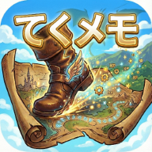
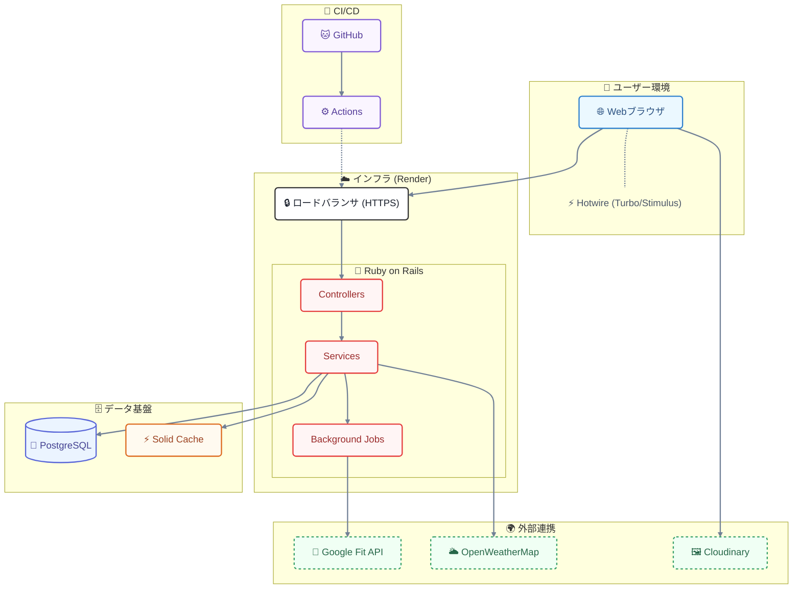
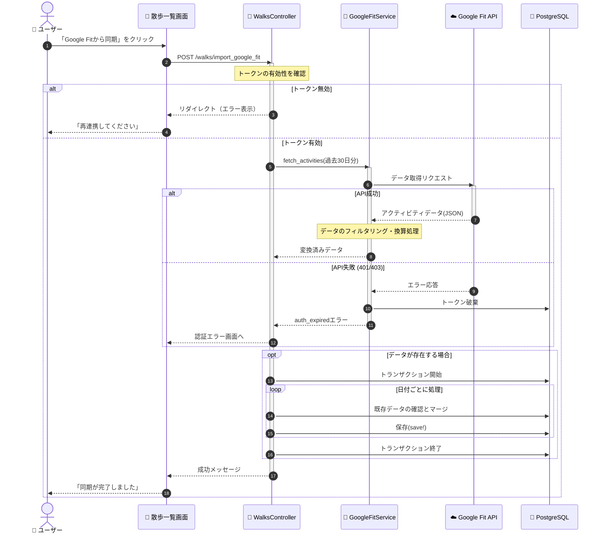

<div align="center">
  
  <h1>てくメモ ～てくてくメモリア～</h1>
  
  <p>
    <strong>デスクワークでなまった体を、エンジニアリングで動かす。</strong><br>
    働き盛り世代のための、散歩習慣化コミュニティプラットフォーム。
  </p>

[](https://rubyonrails.org/)
[](https://www.ruby-lang.org/)
[](https://www.postgresql.org/)
[](https://www.docker.com/)
[](https://tekumemo.onrender.com)
[](https://github.com/Yadon987/tekumemo/actions)
<br>

[](https://tekumemo.onrender.com)  
<small>（ゲストログイン機能があり、ワンクリックでお試しいただけます 🚀）</small>

</div>

https://github.com/user-attachments/assets/43e280c3-2bbe-4e0c-8960-45760f61e1c7

---

## 📖 30 秒でわかる「てくメモ」

- **🏃 自動記録**: Google Fit 連携により、スマホを持って歩くだけで歩数・距離・カロリーを完全自動記録。
- **🤝 ゆるい繋がり**: 「いいね」以上の豊富なリアクションやスタンプ機能で、孤独になりがちな運動をサポート。
- **🏆 楽しみ続く**: ランキング機能や称号バッジにより、毎日の散歩を「ゲーム感覚」で楽しめる習慣へ。**（ゲストログインですぐ試せます）**

## 💡 サービス概要

### **「毎日の散歩を、ちょっとしたイベントに。」**

**てくてくメモリア**は、散歩の記録、歩数の可視化、ランキング機能を核とし、働き盛り世代の散歩のモチベーション維持と習慣化をサポートするコミュニティ型のお散歩習慣化アプリです。
単調になりがちな日々の散歩を、以下の機能でサポートします。

- **達成感の可視化**: 連続ログインスタンプ、歩数ランキング、称号バッジ機能
- **ゆるい繋がり**: 「応援」や「すごいね」などのリアクション、フォロー機能
- **快適なツール**: 天気予報連携、Google Fit による自動計測

#### 🎯 ターゲット・利用シーン

- **ターゲット**: 健康に気を使い始める 20 代から 60 代の働き盛り世代
- **利用シーン**: 通勤中や散歩中など、屋外での利用
- **ダークモード対応 🌙**: 早朝や深夜の利用でも目に優しい配色を採用
- **UI/UX の配慮 📱**: 歩きながらでも操作しやすい大きめのボタン設計

#### 📣 ユーザー獲得戦略

ターゲット層に対して、以下のアプローチを実施します。

1. **SNS活用**: 散歩の成果をOGP画像付きでX（旧Twitter）にシェアできる機能を実装し、バイラルによる拡散を狙います。
2. **気軽にお試し**: ゲストログイン機能により、ユーザーが友人を気軽に誘える導線を確保しました。
3. **デザイン戦略**: ターゲット層を最大化するため、利用シーンとユーザー属性に合わせて**2 つの全く異なるデザインシステム**を構築しました。
4. **オンボーディングとLPの強化**: アプリの価値を一目で伝えるLPと、直感的なオンボーディングにより、初見ユーザーの離脱を防ぎ定着率を高めます。

---

## 🗣️ 開発背景 & 解決したい課題

> **「最高のパフォーマンスは、健やかな体と心から生まれる」**

現代の Web エンジニアやデスクワーカーにとって、長時間の座り作業は避けられない現実です。しかし、運動不足は単なる体力低下だけでなく、メンタルヘルスの不調や生産性の低下を招きます。
スティーブ・ジョブズをはじめ多くの偉人が「散歩」を愛したように、**歩くことは脳を活性化させ、クリエイティブな課題解決能力を高めるための最強のメソッド**でもあります。

私自身、毎日 10 時間前後のプログラミング学習に没頭する中で、**「エンジニアにとって体こそが最大の資本であり、ボトルネックである」** と痛感しました。
しかし、頭では理解していても、目的のない単調な散歩を一人で継続するのは極めて困難です。「今日は忙しいから」「雨だから」「花粉症が…」——自分への言い訳はいくらでも出てきます。

**「このままでは、長く走り続けることはできない」**

そんな危機感から、私は**エンジニアリングの力で「歩く習慣」を課題解決し、孤独な努力を「ちょっとしたエンターテインメント」に変える**ための挑戦を始めました。
このアプリは、単なる歩数計ではありません。同じようにデスクに向かう仲間たちが、互いの「一歩」を称え合い、共にキャリアを長く、健康に走り続けるための**ペースメーカー**となることを目指しています。

### 😣 ユーザーが抱える課題

1. **達成感の欠如**: ただ歩くだけでは成果が見えにくく、「頑張り」を感じられない。
2. **モチベーション低下**: 一人で黙々と続けるのは孤独で、飽きが来やすい。
3. **記録の手間**: わざわざアプリを開いてポチポチとデータ入力をするのは面倒で続かない。

### 💡 このアプリのアプローチ

| 課題               | 解決策                                                                                                   |
| ------------------ | -------------------------------------------------------------------------------------------------------- |
| **達成感**         | Google Fit 連携による自動計測と、ログインスタンプによる可視化                                            |
| **モチベーション** | 「応援」「すごいね」などの多様なリアクションと、ランキング、称号、OGP 画像などのゲーミフィケーション要素 |
| **手間ゼロ**       | 歩数や消費カロリーはバックグラウンドで自動取得、一瞬で散歩記録を入力しデータ分析                         |

---

## 🔥 サービスの差別化・推しポイント

既存のヘルスケアアプリの「ただ記録するだけ」という課題に対し、以下の4つの観点で差別化を図りました。

### 1. ❤️ 多様なリアクション機能

単なる「いいね」ではなく、「応援」「すごい」「頑張って」など、**感情豊かなリアクション**を設計。働き盛り世代の励まし合いに特化し、孤独になりがちな運動習慣を温かい繋がりで支えます。

### 2. 🚀 実用性重視の設計

生活に溶け込む実用性を徹底追求しました。

- **天気予報連携**: 散歩の計画をサポートし、雨の日の挫折を防止。
- **Google Keep連携**: 散歩中のアイデアやひらめきを逃さず記録。
- **シンプル記録**: 忙しい世代でも続けやすい、最低限の操作で完結するUI。

### 3. 🤝 適度なコミュニティ感

過度なSNS化（疲れ）を避け、**健康習慣に集中した設計**にこだわりました。テキストよりもスタンプ主体のコミュニケーションにより、プライバシーを守りながら「ゆるい繋がり」を感じられます。

### 4. 🔄 継続を支える仕組み

- **ログインスタンプ**: 毎日の訪問自体を評価し、習慣化をサポート。
- **目標達成率の可視化**: 進捗をグラフで直感的に表示し、モチベーションを維持。
- **ランキング**: 適度な競争要素により、運動を「作業」から「遊び」へ変えます。

---

## ✨ 主要機能

<table>
  <tr>
    <th width="50%">🏃 自動記録 & 可視化</th>
    <th width="50%">🤝 コミュニティ体験</th>
  </tr>
  <tr>
    <td valign="top">
      <strong>Google Fit 完全連携</strong><br>
      スマホを持って歩くだけ。歩数・距離・カロリーを自動でグラフ化します。
    </td>
    <td valign="top">
      <strong>12 種類のリアクション</strong><br>
      「すごい！」「お疲れ様」など、タップ一つでリッチなアニメーションと共に気持ちを伝えます。
    </td>
  </tr>
  <tr>
    <td valign="top" align="center">
      
    </td>
    <td valign="top" align="center">
      
    </td>
  </tr>

  <tr>
    <th width="50%">🏆 ゲーミフィケーション</th>
    <th width="50%">🎨 選べる世界観</th>
  </tr>
  <tr>
    <td valign="top">
      <strong>ランキング & 称号</strong><br>
      フレンドと競い合い、特定の条件クリアでバッジを獲得。
    </td>
    <td valign="top">
      <strong>Light / Dark モード</strong><br>
      昼はクレイモーフィズム、夜はネオンノワール。
    </td>
  </tr>
  <tr>
    <td valign="top" align="center">
      
    </td>
    <td valign="top" align="center">
      
    </td>
  </tr>
</table>

---

## 📅 機能実装ステータス

### ✅ MVP (ver 1.0) - 実装済み

- [x] **CRUD操作・DB操作**: 投稿、ユーザー認証などの基礎実装
- [x] **歩数記録・表示**: Google Fit連携によるメイン機能
- [x] **継続スタンプ + カレンダー**: 習慣化の核機能
- [x] **リアクション機能**: コミュニティの基盤
- [x] **非同期通信**: 投稿・API取得のUX向上
- [x] **外部API連携（Google Fit）**: 自動計測の利便性
- [x] **外部API連携（天気予報）**: 散歩計画の実用性
- [x] **Googleログイン**: 将来的なユーザー拡大の基盤

### 📋 開発初期の機能要件と優先度定義

開発着手時に策定した、機能ごとの優先度と導入目的の一覧です。

| 優先度            | 技術要素                      | 目的                                                                          |
| :---------------- | :---------------------------- | :---------------------------------------------------------------------------- |
| **最優先（MVP）** | **CRUD操作・DB操作**          | 投稿、ユーザー認証・ログインなどのデータ永続化に必須                          |
| **最優先（MVP）** | **歩数記録・表示**            | メイン機能                                                                    |
| **最優先（MVP）** | **継続スタンプ + カレンダー** | 習慣化の核機能。実装が比較的容易                                              |
| **最優先（MVP）** | **リアクション機能**          | コミュニティの基盤。多様な反応で継続モチベーション向上                        |
| **最優先（MVP）** | **非同期通信**                | 投稿データの送受信、外部APIデータ取得時のUX向上                               |
| **最優先（MVP）** | **外部API連携（Google Fit）** | ユーザーの面倒なデータ入力の手間を省く                                        |
| **最優先（MVP）** | **外部API連携（天気予報）**   | ユーザーが散歩計画を立てるための実用性                                        |
| **最優先（MVP）** | **Googleログイン**            | ログインの手間を減らす                                                        |
| **中優先**        | **Web Push通知**              | 継続利用を促すためのプッシュ通知（Service Worker）                            |
| **中優先**        | **ランキング機能**            | ゲーミフィケーション要素                                                      |
| **中優先**        | **GoogleマップAPI連携**       | 歩行距離表示など、高度なUXを実現                                              |
| **中優先**        | **PWA化**                     | アプリのような操作性を提供し、ホーム画面からの起動を可能に                    |
| **中優先**        | **OGP画像自動生成**           | SNSシェア時のクリック率向上（Cloudinary）                                     |
| **低優先**        | **グラフ機能**                | ユーザー体験を向上させるための可視化                                          |
| **低優先**        | **ページネーション**          | 投稿数増加時のパフォーマンス維持（Kaminari）                                  |
| **低優先**        | **継続スタンプ補填**          | 雨などで連続ログインが止まらないように運動ガチャでスタンプを補填              |
| **低優先**        | **アチーブメント機能**        | 目標達成の可視化 一つ一つリッチなデザインを考え実装する時間がかかるため低優先 |
| **低優先**        | **ゲスト機能**                | 影響範囲が広大なため最後にまとめて実装予定                                    |
| **低優先**        | **アナウンス機能**            | メンテナンスや新機能のお知らせ。運営からの透明性を担保                        |
| **低優先**        | **管理画面**                  | ユーザー管理・不適切コンテンツ対応など、健全なコミュニティ運営に必須          |

### 🚧 本リリース(ver 2.0)後に実装予定

- [ ] **フォロー機能**: ユーザー間の繋がりを強化（相互フォロー、タイムライン表示）
- [ ] **Google マップ連携**: 歩いたルートを地図上に描画し、視覚的な振り返りを強化
- [ ] **パスワード変更機能**: ドメインを取得し、メール送信にてパスワード変更を可能に
- [ ] **Google Cloud 審査**: Google Fit 連携の本番利用承認の取得（現在はテストユーザーのみ）

---

## 🛠️ 技術スタック

### 🏗️ インフラ構成図



### バックエンド

| 技術           | バージョン | 選定理由                                                                                                                                                                                                                       |
| -------------- | ---------- | ------------------------------------------------------------------------------------------------------------------------------------------------------------------------------------------------------------------------------ |
| **Ruby**       | 3.2.2      | Python/Goと比較して、**コード量が圧倒的に少なく可読性が高い**。個人開発で保守性を最優先したかったため採用。                                                                                                                    |
| **Rails**      | 7.2.x      | **MVCの規約が明確**で迷いが少ない。Rails 8系はリリースしてから日が浅いため、未知のバグやエコシステムの追従待ちによる開発遅延リスクを排除し、**安定した開発が可能**な7.2系をあえて選定。Hotwire標準搭載によりリッチなUXを実現。 |
| **PostgreSQL** | 15         | Web開発の現場で広く採用されており、**実務を見据えて学習**したかったため。Render等のPaaS環境でも標準サポートされており、デプロイ時のトラブルが少ない点も重視。                                                                  |

### フロントエンド

| 技術                             | 選定理由                                                                                                                                                                                                                         |
| -------------------------------- | -------------------------------------------------------------------------------------------------------------------------------------------------------------------------------------------------------------------------------- |
| **Hotwire** <br>(Turbo/Stimulus) | React/Vue/Next.jsと比較して、**ビルド環境が不要**で学習コストが低い。サーバーサイドレンダリングを活かしつつ、部分更新やモーダル表示などのリッチなUIを実現。**アプリのような滑らかな操作感**を、Railsエコシステム内で完結できる。 |
| **Tailwind CSS**                 | Bootstrap/daisyUIと比較して、**デザインの自由度が高く、独自の世界観を表現しやすい**。ユーティリティファーストの思想により、クラス名の命名コストをゼロにし、デザインシステムに基づいた一貫性のあるUIを高速に構築。                |

### インフラ・その他

| 技術            | 選定理由                                                                                                                                                                                                                              |
| --------------- | ------------------------------------------------------------------------------------------------------------------------------------------------------------------------------------------------------------------------------------- |
| **Render**      | Heroku/Vercelと比較して、**無料枠が充実**しつつもカスタムドメイン対応などの柔軟性がある。GitHub連携による自動デプロイ（CD）とコストパフォーマンスのバランスが優秀。                                                                   |
| **Solid Cache** | Redisと比較して、**別途サーバーが不要**でDBのみで完結するためインフラコストを削減。個人開発の予算制約内で十分な性能を発揮。                                                                                                           |
| **Supabase**    | RailwayやRender Managed DBと比較して、**無料枠が充実**しており、手軽にPostgreSQL環境を用意できるため採用。ただ、純粋なRDBとして利用する構成上、**サーバーレスPostgreSQLであるNeonの方が適していた**可能性があり、今後の移行を検討中。 |
| **Cloudinary**  | S3/GCSと比較して、**画像最適化（リサイズ・WebP変換）が自動**で行われるため、パフォーマンス向上のための追加実装が不要。OGP画像生成との連携もスムーズ。                                                                                 |
| **Docker**      | ローカル直接インストールと比較して、**「動かない」問題を根絶**。OS・バージョン差異を吸収し、新規メンバーのオンボーディングを数分で完了可能に。                                                                                        |

### 📂 ディレクトリ構成（主要な部分のみ）

`Service` 層や `Job` 層を活用し、Fat Controller を防ぐ設計にしています。

```text
.
├── app
│   ├── controllers          # プレゼンテーション層
│   ├── models              # ドメインロジック
│   ├── services            # 複雑なビジネスロジック (GoogleFit連携など)
│   ├── jobs                # 非同期処理 (データ同期)
│   ├── javascript          # Hotwire (Turbo/Stimulus)
│   └── helpers             # ビューヘルパー
├── config                  # 設定ファイル
├── spec                    # テストコード (RSpec)
└── db                      # データベース定義
```

---

## 💡 技術的なこだわりポイント

### 1. 徹底的にこだわり抜いた「2 つの世界観」による UX

ターゲット層を最大化するため、利用シーンとユーザー属性に合わせて**2 つの全く異なるデザインシステム**を構築しました。

**🌞 Light Mode: Crystal Claymorphism**

- **コンセプト**: 「思わず触りたくなる」
- **ターゲット**: 日中の散歩を楽しむ主婦層や子供たち、リラックスしたい全ユーザー。
- **特徴**: 粘土のような**プニっとした質感**と、立体的で柔らかい影（Claymorphism）。明るくポップな配色で、親しみやすさと直感的な操作性を実現しました。

**🌙 Dark Mode: Holographic Neon Noir**

- **コンセプト**: 「夜に輝く、大人の没入空間」
- **ターゲット**: 仕事終わりの夜から早朝にかけて活動する、働き盛りのエンジニアやビジネスパーソン。
- **特徴**: サイバーパンクや高級ガジェットを彷彿とさせる**プレミアムな質感**。ネオンの光彩と深い闇のコントラストが、少しアダルトでワクワクするような高揚感を演出し、利用者の所有欲を満たします。

この 2 つの顔を使い分けることで、 **「機能としての使いやすさ」だけでなく「使うこと自体の喜び」** を提供します。

### 2. N+1 問題の徹底排除とパフォーマンス

開発段階から `Bullet` gem を導入し、N+1 問題を即座に検知・修正しています。特にランキングやタイムライン表示部分では `includes` や `counter_cache` を適切に使用し、レスポンス速度を維持しています。

### 3. テスト駆動による品質担保

個人開発でも品質を妥協せず、CI/CD を見据えたテスト環境を構築しました。

- **RSpec** による単体・結合テスト（320+ ケース以上を維持）
- **SimpleCov** によるカバレッジ計測（カバレッジ率 **74.6%** を維持）
- **RuboCop** によるコード規約の統一

### 4. セキュリティへの配慮

- `Brakeman` による静的解析で脆弱性をチェック
- 開発環境と本番環境でデータベース接続情報を厳格に分離（`.env`管理の徹底）

## 📐 設計ドキュメント

### 🧬 シーケンス図: Google Fit データ同期フロー

ユーザーが手動で「Google Fit から同期」ボタンを押した際のデータ取得・保存処理の流れです。`Service` 層を使用することで、コントローラーを肥大化させずにビジネスロジック（自転車換算など）を管理しています。



### 🗺️ 画面遷移図 (Figma)

[](https://www.figma.com/board/U1dqKDAMsI9lNTAEYcGTOV/FigJam-basics?node-id=0-1&p=f&t=ZDUfKhhX3F41N6dn-0)

> [Figma Board で見る](https://www.figma.com/board/U1dqKDAMsI9lNTAEYcGTOV/FigJam-basics?node-id=0-1&p=f&t=ZDUfKhhX3F41N6dn-0)

### 🗂️ ER 図 (dbdiagram.io)

[](https://gyazo.com/e7e5ef231e64ab355c1c605a2842cbac)

> [dbdiagram.io で詳細を見る](https://dbdiagram.io/d/68f9ef31357668b7323f223e)

## 💻 開発環境のセットアップ

チームメンバーが環境を構築する手順です。

<summary><h3>👇詳細な手順を表示</h3></summary>
<details>
<summary><strong>クリックして展開</strong></summary>

### 前提条件

- Docker Engine / Docker Compose
- Windows ユーザーの方は **WSL2 (Ubuntu)** 上での実行を強く推奨します。

### 手順

```bash
# 1. リポジトリのクローン
git clone https://github.com/Yadon987/tekumemo.git
cd tekumemo

# 2. 環境変数の設定
cp .env.example .env
# .env をエディタで開き、必要なAPIキーを設定してください
# ※ 最低限の起動には設定不要（天気情報はダミーデータ表示）
# ※ Googleログインを使用する場合は GOOGLE_CLIENT_ID/SECRET が必要

# 3. コンテナのビルドと起動
docker compose up -d

# 4. データベース作成とマイグレーション
docker exec tekumemo-web bash -c "bundle exec rails db:create db:migrate db:seed"
```

アプリは `http://localhost:3000` で起動します。

### テストの実行

Docker 環境内で全テストを実行し、カバレッジを出力するスクリプトを用意しています。

```bash
chmod +x bin/test_all.sh
./bin/test_all.sh
```

### ⚠️ 重要: 環境変数の管理

このプロジェクトでは、**開発環境と本番環境で異なる環境変数ファイルを使用**します：

- **`.env`** - 開発環境用（ローカル Docker 環境）
  - `DATABASE_URL`は**設定しないでください**
- **`.env.production`** - 本番環境用（Supabase 使用）
  - 本番デプロイ時のみ使用

</details>

## 📝 変更履歴

| Version  |    Date    | Description                                                                         |
| :------: | :--------: | ----------------------------------------------------------------------------------- |
| **v1.6** | 2026-01-18 | **README刷新**<br>デザインの改善、技術スタック詳細の追記、インフラ構成図の整備      |
| **v1.5** | 2025-12-03 | **MVP リリース & ドキュメント整理**<br>初期機能の実装完了およびREADMEの全面改訂     |
| **v1.4** | 2025-11-12 | **名称変更 & 認証機能強化**<br>アプリ名を『てくてくメモリア』に変更、Devise認証導入 |
| **v1.3** | 2025-11-09 | **設計フェーズ完了**<br>ER図の作成、データベース設計の確定                          |
