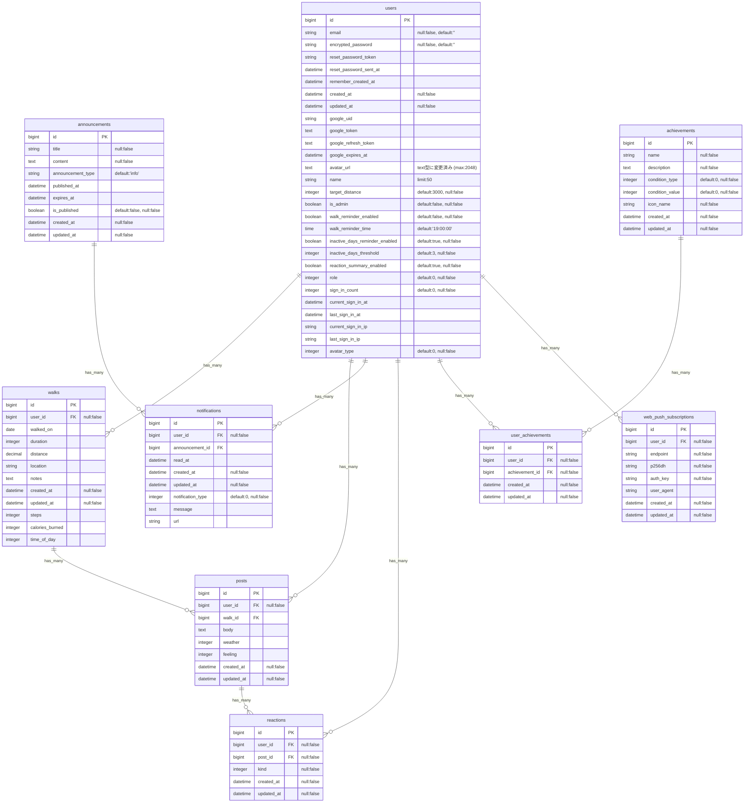

# README

# **てくメモ**

> ⚠️ **MVP(β 版)について**
> 本アプリは現在開発中のベータ版です。バグや不具合が含まれる可能性があります。
> 既知の問題は → [GitHub Issues](https://github.com/Yadon987/tekumemo/issues/142)
> 💡 本プロジェクトでは、カリキュラムの復習と自分に足りない物の洗い出しのため、AI エージェントを積極的に活用しています。

アプリ正式名称：てくてくメモリア

## サービス概要

散歩の記録、歩数の可視化、ランキング機能を核とし、働き盛り世代のモチベーション維持と習慣化をサポートします。

投稿やリアクション機能を通じて「頑張り」を共有し、フォロー機能で気の合う仲間とのつながりを作ることで、飽きによる挫折を防ぎ達成感を与えます。

天気予報やランキング機能で、毎日の散歩を「ちょっとしたイベント」に変え、日々の健康づくりを継続的に促す**コミュニティ型のお散歩習慣化アプリ**です。

## このサービスへの思い・作りたい理由

散歩を習慣化したい働き盛り世代の挫折を防ぐため。

日々の**「頑張り」を記録・可視化することで達成感とモチベーション**を維持したい。

単調な散歩を乗り越え、健康習慣を定着させるためのアプリを提供したい。

## ユーザー層について

**ターゲット：** 健康に気を使い始める 20 代から 60 代の働き盛り世代　外出中のスマホ利用を想定

## サービスの利用イメージ

- 外で使うことを想定
- 社会人は早朝や深夜に使う想定でデザイン(ダークモード機能など)に配慮が必要
- 逆に日中に活動が多い主婦や若者世代にはポップでモダンなデザインで差別化を図り、幅広いユーザー獲得を目指す
- 歩きながら短時間で操作しやすいようにボタンの大きさや配置に配慮が必要

## ユーザーの獲得について

Coming soon……

## サービスの差別化ポイント・推しポイント

### **1. 多様なリアクション機能**

- 単なる「いいね」ではなく「応援」「すごい」「頑張って」など感情豊かな反応
- 働き盛り世代の励まし合いに特化したリアクション設計

### **2. 実用性重視の設計**

- 天気予報連携で散歩計画をサポート
- Google Keep 連携で散歩中のひらめきを逃さない
- 忙しい世代でも続けやすいシンプルな記録方式

### **3. 適度なコミュニティ感**

- フォロー機能で気の合う仲間を見つけられる
- 過度な SNS 化を避け、健康習慣に集中した設計
- プライバシー設定で安心して利用可能

### **4. 継続を支える仕組み**

- ログインスタンプで習慣化をサポート
- 目標達成率の可視化でモチベーション維持
- ランキングで適度な競争要素を提供

## できること（機能一覧）

### **認証・基本機能**

- ログイン・ユーザー管理
- ユーザープロフィール設定
- ログインスタンプ機能

### **散歩記録機能**

- 散歩投稿の追加・編集・削除
- 歩数・距離・時間の記録
- Google Fit 連携

### **コミュニティ機能**

- リアクション機能（いいね、応援、すごい等）
- フォロー・フォロワー機能（将来実装予定だが利用者が少ない現時点では過剰）

### **実用機能**

- 天気予報の閲覧
- 歩数・距離ランキング
- 目標設定と達成率表示

### **外部連携**

- Google Keep のリンク・アプリ起動

### **将来実装予定**

- 位置情報の取得・ルート表示
- 歩数と距離の自動計算
- 散歩リマインダー通知
- グラフ・統計表示
- Google ログイン

## 機能候補と優先順位

| 優先度            | 技術要素                        | 目的                                                                        |
| :---------------- | :------------------------------ | :-------------------------------------------------------------------------- |
| **最優先（MVP）** | **CRUD 操作・DB 操作**          | 投稿、ユーザー認証・ログインなどのデータ永続化に必須                        |
| **最優先（MVP）** | **歩数記録・表示**              | メイン機能                                                                  |
| **最優先（MVP）** | **継続スタンプ + カレンダー**   | 習慣化の核機能。実装が比較的容易                                            |
| **最優先（MVP）** | **リアクション機能**            | コミュニティの基盤。多様な反応で継続モチベーション向上                      |
| **最優先（MVP）** | **非同期通信**                  | 投稿データの送受信、外部 API データ取得時の UX 向上                         |
| **最優先（MVP）** | **外部 API 連携（Google Fit）** | ユーザーの面倒なデータ入力の手間を省く                                      |
| **最優先（MVP）** | **外部 API 連携（天気予報）**   | ユーザーが散歩計画を立てるための実用性                                      |
| **最優先（MVP）** | **Google ログイン**             | ログインの手間を減らす                                                      |
| **高優先**        | **フォロー機能**                | 継続的なコミュニティ形成。モチベーション維持の核                            |
| **中優先**        | **ランキング機能**              | ゲーミフィケーション要素                                                    |
| **中優先**        | **Google マップ API 連携**      | 歩行距離表示など、高度な UX を実現                                          |
| **低優先**        | **通知機能**                    | 継続利用を促すためのプッシュ通知                                            |
| **低優先**        | **グラフ機能**                  | ユーザー体験を向上させるための可視化                                        |
| **低優先**        | **継続スタンプ補填**            | 雨などで連続ログインが止まらないように運動ガチャでスタンプを補填            |
| **低優先**        | **フォロー機能**                | 継続的なコミュニティ形成。本来は高優先度だがユーザーが少ないうちは低優先度  |
| **ボツ案**        | **アチーブメント機能**          | 目標達成の可視化 一つ一つリッチなデザインを考え実装する時間がかかるためボツ |

## 使用する技術スタック

### **バックエンド**

- **言語・フレームワーク:** Ruby 3.2.2 + Ruby on Rails 7.2.x
- **データベース:** PostgreSQL(Supabase)
- **認証:** Devise
- **API 連携:** net-http（Rails 標準）or OpenWeatherMap API（天気予報）

### **フロントエンド**

- **スタイリング:** Tailwind CSS CLI
- **JavaScript:** Hotwire (Turbo / Stimulus)

### **インフラ・API**

- **デプロイ先:** Render
- **デザインツール:** Google Stitch・Figma
- **バージョン管理:** Git/GitHub
- **Auth:** Devise, OmniAuth (Google OAuth2)
- **External APIs:**
  - Google Fit API (REST)
  - OpenWeatherMap API
  - Windy.com (Embed)

## 🐳 開発環境

### **前提条件**

- **Docker Engine** (WSL2 上で動作)
- **docker-compose**

### **環境構築**

```bash
# コンテナの起動
docker compose up -d

# 初回のみ: データベース作成とマイグレーション
docker exec tekumemo-web bash -c "bundle exec rails db:create db:migrate"
```

### **テスト実行**

⚠️ **重要: このプロジェトでは Docker 環境でのテスト実行が必須です**

```bash
# 全テストを実行（推奨）
./bin/test_all.sh

# 個別にテストを実行する場合
docker exec tekumemo-web bash -c "RAILS_ENV=test bundle exec rspec spec/models/user_spec.rb"

# システムテストのみ実行
docker exec tekumemo-web bash -c "RAILS_ENV=test bundle exec rspec spec/system/"
```

**テストスクリプトが実行すること:**

1. Docker コンテナの起動確認
2. テストデータベースの準備
3. RuboCop によるコードスタイルチェック
4. RSpec による全テスト実行（306 項目）

**初回のみ実行権限付与:**

```bash
chmod +x bin/test_all.sh
```

## 画面遷移図(暫定版)

### PC 版

Figma：(https://www.figma.com/board/U1dqKDAMsI9lNTAEYcGTOV/FigJam-basics?node-id=0-1&p=f&t=ZDUfKhhX3F41N6dn-0)
[](https://gyazo.com/46f161ccd35179b545c2b700eeb17617)

### スマホ版

Coming soon…

## ER 図

DBdiagram.io：(https://dbdiagram.io/d/68f9ef31357668b7323f223e)
[](https://gyazo.com/64860b5543da663f10485e3604e4e2c0)



### DB 設計メモ（現状）

- **ユーザー管理**: `users` テーブルにて認証情報、プロフィール、各種設定を一元管理。
- **散歩記録と投稿**: 客観的な実績データは `walks` テーブル、ユーザーの感想や天気などの投稿内容は `posts` テーブルに分離して管理。`posts` は `walks` に紐づく形をとっています。
- **通知機能**: お知らせやリマインダーなどの通知は `notifications` テーブルで管理。

## 今後の改善ポイント

Google Cloud の審査を早めに通す
AWS のキャッチアップを済ませて、パスワードリセットのメール送受信を実装する

## 📝 変更履歴

v1.3 　 ER 図の作成と仕様変更

v1.4 　アプリ正式名称を『てくてくメモリア』に変更

v1.5 MVP リリースのドキュメント整理

v1.6 ER 図の修正とターゲット層・デザイン方針の微調整
